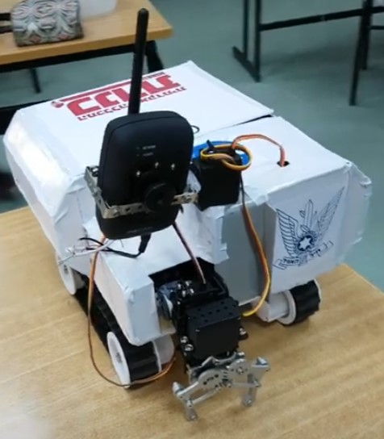
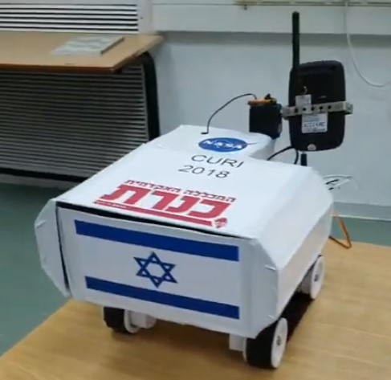
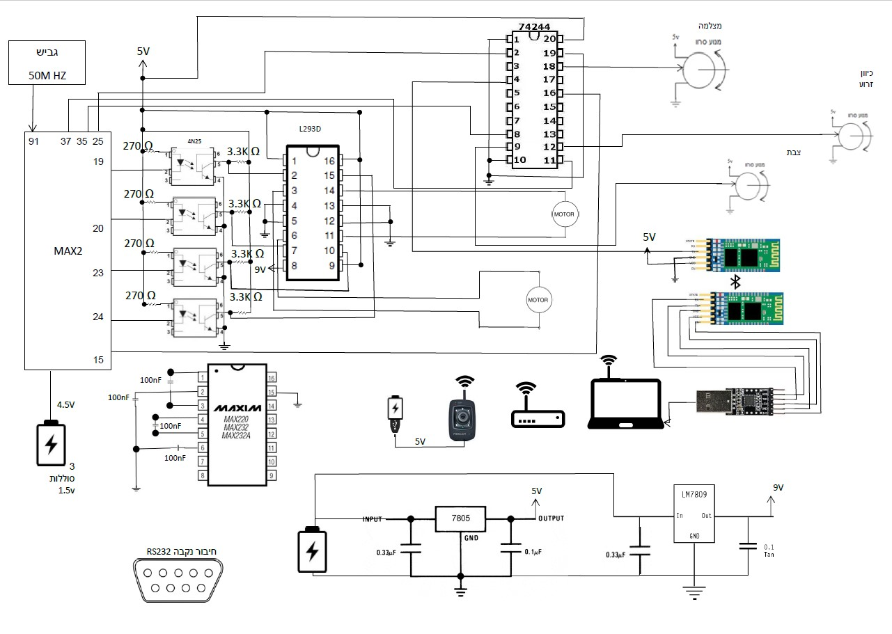

# Mini Space Rover Curi
 Final project in Practical Engineering in Electronics 
last update: 22/05/18- Submission version

[Demonstration video]()

## Images of the project

### Project's circuits

## Description

The purpose of this project was

## Block diagram 

## Schematic of the project

## Operating principle

## Authors

**Dan Neytur** - [DanNeytur](https://github.com/DanNeytur)

